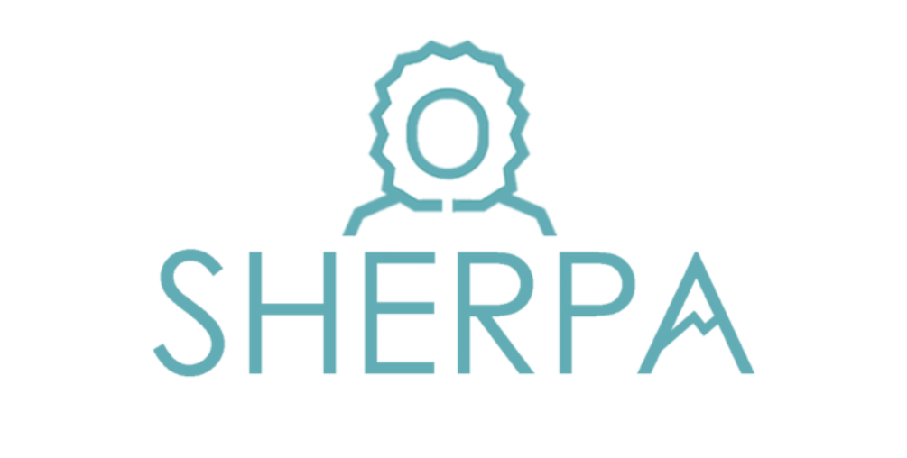
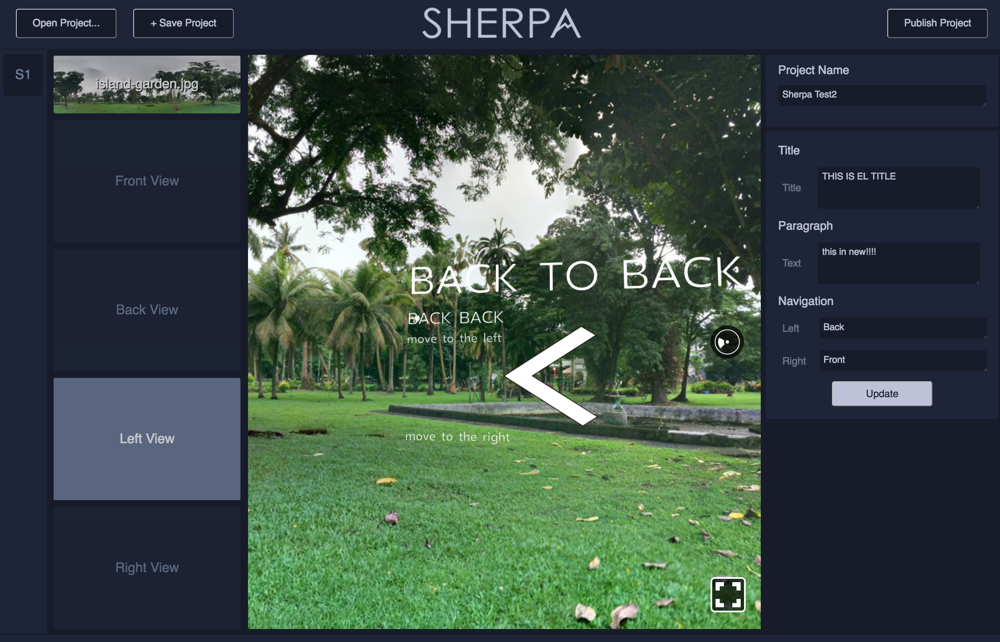

# Sherpa-UI 
## A ReactVR Website Builder

Sherpa-UI allows you to rapidly create engaging experiences in VR that emulate traditional web-browsing.  

Built with React.JS and Electron, SherpaUI is for developers and non-developers alike.

ReactVR provides a 3D 'sphere' in which a camera is placed at the very center, and allows for a 360° x 360° field of view.  Shepra-UI streamlines development in this environment by splitting the spehre into four equal sections.  Text that you enter in the input fields on the right will show up in the VR image after clicking 'Update'.

### Features:
1. Upload your own equirectangular panoramic images.
2. Add custom text content into the 3D environment.
3. Navigation UI between four distinct 'panes'.
4. Preview how your project will look online before you deploy.
5. Bundle and export your completed project to your desktop with a button click.

## To run on your local machine
* Fork or download repository `git clone *** `
* cd into repository `cd Sherpa-UI`
* install dependencies `npm install`
* run the app `npm start`

### To open new image, click on 'change image' thumbnail in left column
###To build ReactVR project and export to desktop, click 'Publish Project'

 
## Contributors
[Aaron Goldsmith](https://github.com/AaronGoldsmith1) | [Alyssa Gaudioso](https://github.com/alyssagaudioso) | [Josh Wolters](https://github.com/joshwolters12)  

 

